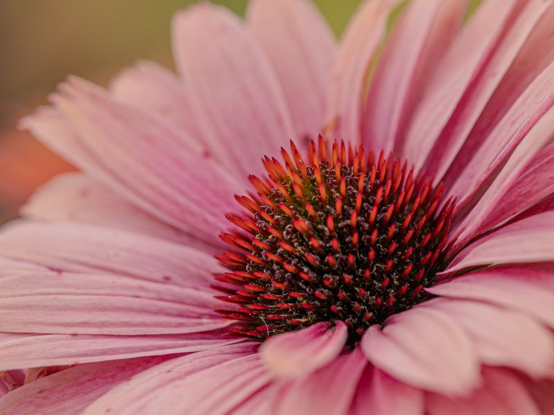

# Projet : Changement de palette de couleurs
---
**Auteur :** Rémi Cozot, **Date :** 5 novembre 2024

---

## Objectif
Ce projet vise à implémenter **2** algorithmes de **transfert de couleur**.
Le premier est un transfert de palettes de couleurs, le second est un transfert par clusters.


## Fonctions à implémenter
### read_image_as_float(image_path: str) -> np.ndarray

Lit une image à partir d'un fichier et la convertit en un tableau `NumPy` de type `float64` avec des valeurs comprises entre 0 et 1.

*Exemple d'utilisation:*
``` 
image : np.ndarray = read_image_as_float('mon_image.jpg')
```

### cluster_image(image: np.ndarray, n_colors: int = 5) -> Tuple[np.ndarray, np.ndarray]

Clusterise une image en utilisant l'algorithme K-Means.

```
Arguments:
image: Le tableau NumPy représentant l'image.
n_colors: Le nombre de clusters (couleurs) à utiliser.

Retourne:
Un tuple contenant les centroïdes des clusters et les labels de chaque pixel.
```

*Exemple d'utilisation:*
``` 
clusters, labels = cluster_image(image, n_colors=10)
```

### recreate_image(codebook: np.ndarray, labels: np.ndarray, w: int, h: int) -> np.ndarray

Reconstruit l'image compressée à partir des centroïdes des clusters et des labels des pixels.

```
Arguments:
codebook: Les centroïdes des clusters.
labels: Les labels des pixels.
w: La largeur de l'image.
h: La hauteur de l'image.

Retourne:
Le tableau NumPy représentant l'image reconstruite.
```

*Exemple d'utilisation:*
```
image_reconstruite = recreate_image(clusters, labels, image.shape[0], image.shape[1])
```

### generate_uniform_images(colors: List[Tuple[float, float, float]], size: int) -> List[np.ndarray]


Génère une liste d'images uniformes de la taille spécifiée, chacune avec une couleur de la liste colors. Cette fonctiuon permet d'afficher la palette calculer à partir de la fonction `cluster_image`.

*Exemple d'utilisation:*
```
images_uniformes = generate_uniform_images(clusters, 128)
```

### create_horizontal_image(images: List[np.ndarray]) -> np.ndarray

Crée une image en concaténant horizontalement les images de la liste images.  Cette fonctiuon permet d'afficher la palette calculer à partir de la fonction `cluster_image`.

*Exemple d'utilisation:*
```
palette = create_horizontal_image(images_uniformes)
```

### map_clusters(clusters1, clusters2)

Calcule une correspondance entre les clusters de deux images en fonction de leur distance euclidienne.

```
Arguments:
clusters1: Les centroïdes des clusters de la première image.
clusters2: Les centroïdes des clusters de la deuxième image.

Retourne:
Une liste de tuples, où chaque tuple contient les indices des clusters 
correspondants dans clusters1 et clusters2.
```

*Exemple d'utilisation:*
```
 mapping = map_clusters(clusters1, clusters2)
```

### reconstruct_image_from_clusters(image_path1: str, image_path2: str, n_colors: int = 6) -> np.ndarray

Reconstruit une image en utilisant les clusters d'une autre image.

```
Arguments:
image_path1: Chemin vers la première image (source des couleurs).
image_path2: Chemin vers la deuxième image (à reconstruire).
n_colors: Nombre de couleurs à utiliser pour le clustering.

Retourne: 
l'image recontruite en fonction de la palette de couleurs de la deuxième image.
```

## Exemple d'utilisation
On consière une affiche d'un restaurant :

L'affiche n'utilise que 5 couleurs.

Il est décidé de changer l'affiche en fonction d'une  nouvelle palette  :


Malheueursement, la palette de l'affiche initiale a été perdue, il faut donc être capable de la reconstruire à partir de l'image.

De même le stagiaire qui fait la nouvelle palette ne la envoyé qu'en 'jpg'.


```
image2_reconstructed = reconstruct_image_from_clusters('palette5.jpg', 'logo5.jpg',  n_colors= n_colors)
plt.imshow(image2_reconstructed); plt.axis('off'); plt.show()
skimage.io.imsave('image2_reconstructed.jpg', (image2_reconstructed * 255).astype(np.uint8) )
```

Ce transfert de couleur ne fonctionne bien qu'avec des images des couleurs  se limitant à celle de la palette.

Afin de tirer partie de transfert de couleur "basique", qui utilise les tatistiques globales de l'image et l'approche par palette/cluster, on écrit une fonction qui effectue le transfert de couleurs par cluster/couleur de la palette.

On écrit une fonction :
## def transfer_colors_by_cluster(source_image: np.ndarray, target_image: np.ndarray, n_colors: int = 5) -> np.ndarray:

```
Arguments:
source_image: The source image.
target_image: The target image.
n_colors: The number of clusters to use for color transfer.

Retournes:
The color-transferred target image.   
```

Le résultat attendu est :

*Image source pour les couleurs*

*Image cible*

*Transfert Global*


*Transfert réduit aux palettes*


*Transfert par palettes*
